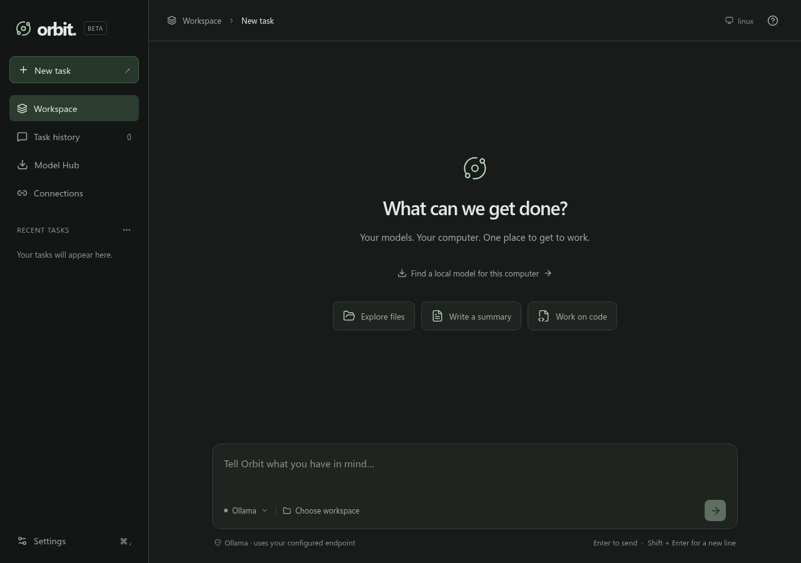
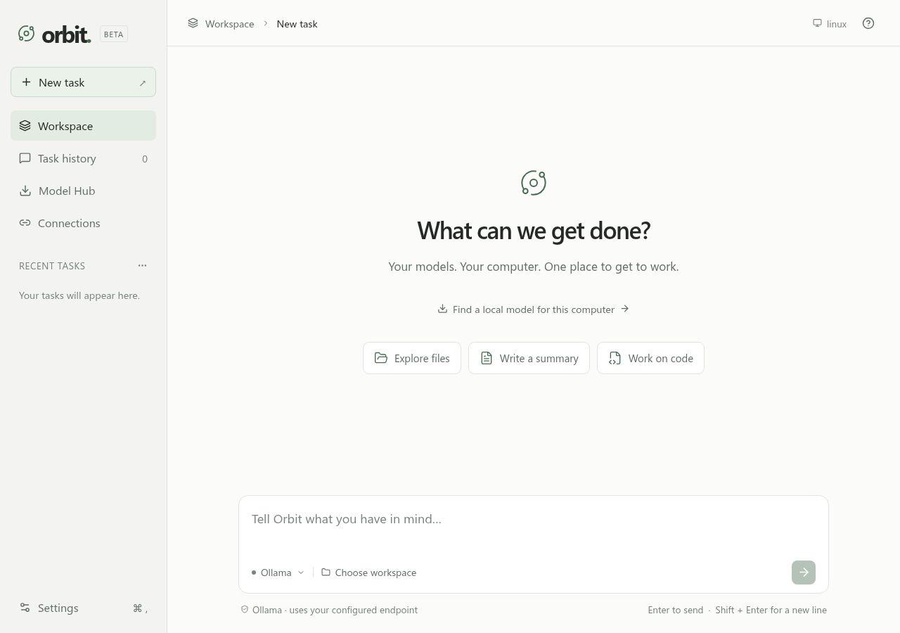
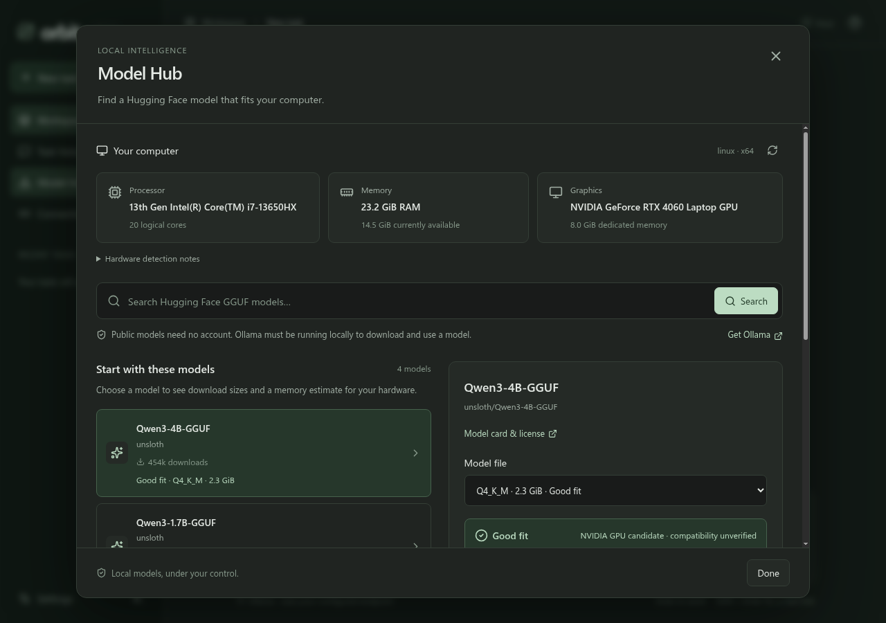
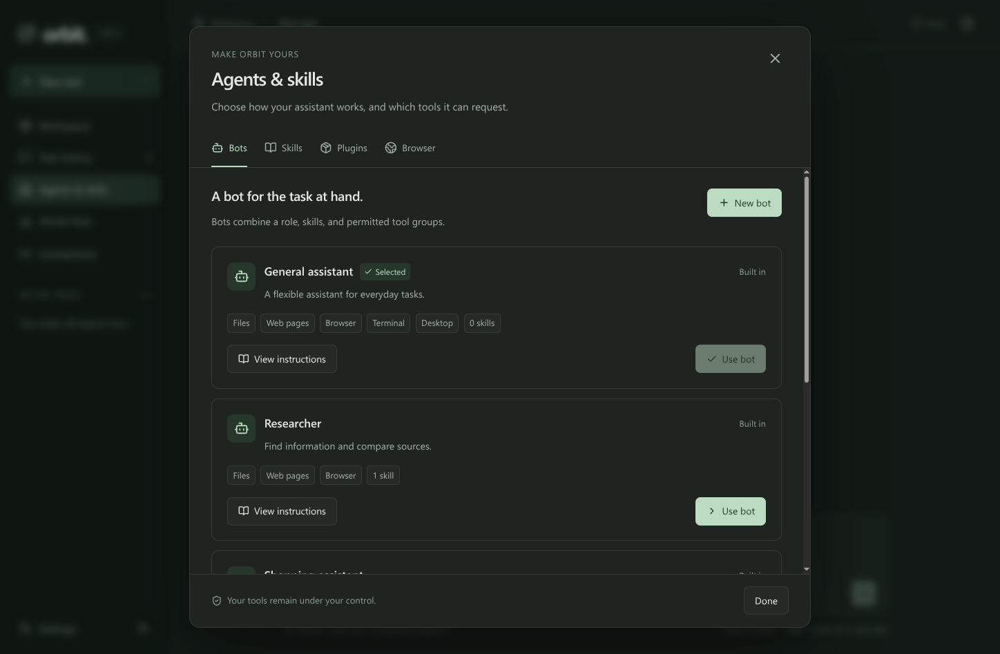

# Orbit — a desktop AI assistant

Orbit 0.3 adds a separate Chrome/Edge browser, reusable skills, bot profiles and installable instruction plugins. Cloud models can operate these tools without a local model. See [the agent setup guide](docs/AGENTS-AND-SKILLS.md). The Hugging Face Hub, hardware estimates and appearance preferences remain available.

Orbit is a working first version of a desktop agent for **macOS, Windows, and Linux**. It runs its tools on your computer. Choose a local model, an API provider, or the official Codex engine with ChatGPT sign-in.

It can inspect a folder, read and write text files, fetch web pages, run commands, and optionally use your mouse, keyboard, and screenshots. Its abilities depend on the model, installed tools, operating-system permissions, and your approvals. It does not promise to perform every possible task.

## Help build Orbit

1. [Read the beginner contribution guide](CONTRIBUTING.md) to set up a fork, run the app and tests, and propose a focused change. The demo and unit tests need no API key.
2. [Report a reproducible bug or suggest an improvement](https://github.com/aaka3h/orbit-desktop/issues/new/choose). Documentation, operating-system bug reports, tests, translation suggestions, and accessibility improvements are all useful contributions.
3. [Open a pull request](https://github.com/aaka3h/orbit-desktop/pulls) against `main`. Maintainers review contributions before merging; your fork lets you work without changing the main project directly.

## Download and install

1. Open the [**Orbit v0.3.0 beta release**](https://github.com/aaka3h/orbit-desktop/releases/tag/v0.3.0). The repository and release downloads are public; no GitHub sign-in is required.
2. Under **Assets**, download the app for your computer:

   - **Linux x64:** [Orbit-0.3.0.AppImage](https://github.com/aaka3h/orbit-desktop/releases/download/v0.3.0/Orbit-0.3.0.AppImage)
   - **Windows x64:** [Orbit-Setup-0.3.0.exe](https://github.com/aaka3h/orbit-desktop/releases/download/v0.3.0/Orbit-Setup-0.3.0.exe)
   - **Mac, Apple Silicon:** [Orbit-0.3.0-arm64-mac.zip](https://github.com/aaka3h/orbit-desktop/releases/download/v0.3.0/Orbit-0.3.0-arm64-mac.zip)
   - **Mac, Intel:** [Orbit-0.3.0-mac.zip](https://github.com/aaka3h/orbit-desktop/releases/download/v0.3.0/Orbit-0.3.0-mac.zip)

3. Follow the [**beginner installation guide**](INSTALL.md) for your operating system. Packaged apps do not require Node.js or npm. GitHub's automatic **Source code** downloads and the optional **Orbit-0.3.0-source.zip** contain code, not an installed app.
4. For local AI, start Ollama, open Orbit's **Model Hub**, download a model that fits, select **Use this model**, and choose a workspace folder. The installation guide explains each step.

These are **unsigned beta packages**; macOS packages are not notarized. Native builds and automated tests are checked in CI. Interactive Windows/macOS installation and real provider-account tasks still need validation. The release also includes **SHA256SUMS.txt** for download verification.

## Screenshots

**Dark workspace:** start a task, choose an AI connection, and select a working folder.



<details>
<summary>Light theme and larger text</summary>

The same workspace in light mode with larger text. Appearance can follow your system or use your preferred theme.



</details>

<details>
<summary>Hugging Face Model Hub and hardware estimates</summary>

Model Hub shows detected hardware, available model files, download sizes, and memory-fit estimates. The hardware shown is one example; your computer's results will differ.



</details>

These screenshots were captured from the running Linux desktop app.



## 1. Run from source (optional)

Install [Node.js 24 LTS](https://nodejs.org/) first. Open a terminal in this project folder and run:

```sh
npm ci
npm run build
npm start
```

`npm ci` installs the exact dependencies in the lock file. `npm run build` compiles the interface and desktop program. `npm start` opens Orbit.

For development, use `npm run dev`. For a browser-only visual preview, use `npm run preview`; browser previews cannot access your computer or run the agent.

## 2. Try the built-in demonstration

1. Open **Settings** and choose a workspace folder. This is the folder the file tools can access.
2. Select **Demo** and save. This is a clearly labeled scripted demonstration, not a language model.
3. Enter a task and send it. Orbit lists your workspace and requests approval to create `orbit-demo.md`.
4. Inspect the proposed file contents, then approve or deny. The result reflects your decision.

This tests the real desktop bridge, agent loop, approval system, and file writing without an API key.

## 3. Connect a local model

1. Install [Ollama](https://ollama.com/).
2. If Ollama is not already running, run `ollama serve`.
3. Open **Model Hub** in Orbit. It detects CPU, available RAM, and GPU information, then shows starter Hugging Face models with conservative memory estimates.
4. Choose a model and its GGUF file. Review the download size, fit explanation, and model card, then click **Download**. Public models need no account. The download starts only after your click.
5. When it finishes, select **Use this model**. Select a workspace and send a task. You can also select an already installed Ollama model through **Settings → AI connection**.

The Hub downloads complete single-file GGUF models through local Ollama. The fit label estimates memory; it is not a speed benchmark or a guarantee of tool support. See [hardware estimates and account setup](UPDATES-0.2.md).

The model runs locally. Model downloads require internet, and web tools still contact websites. Tool quality and speed depend on your model and hardware. Desktop screenshots require a **vision-capable model with tool support**; a text-only model cannot understand screenshots.

For LM Studio or another OpenAI-compatible server, select **OpenAI compatible**, use its base URL (often `http://localhost:1234/v1`), and enter its exact loaded model ID. Compatibility varies by server and model.

## 4. Connect cloud APIs or a subscription

For **Hugging Face Cloud**, select it in Settings and enter your HF access token with inference permission and a supported model ID. Public local model downloads do not need this token. Browser sign-in support requires the publisher's own registered HF OAuth client ID; this development build has no registered client and uses the token connection. Cloud inference may use paid credits.

1. **OpenAI, Claude, or Gemini API:** select the provider, enter your own API key and an available model ID, test, then save. API usage may have separate billing; a chat subscription is not automatically an API key.
2. **ChatGPT subscription:** install the [official Codex CLI](https://learn.chatgpt.com/docs/cli), then choose **ChatGPT subscription (Codex)** and sign in. Orbit uses the documented Codex App Server; Codex itself owns the login and tokens. The account must have supported Codex access. You can leave the model blank to use its default. This experimental integration registers Orbit tools through the official dynamic-tool protocol and shares Orbit approvals. Native Codex tools retain a read-only sandbox with additional feature restrictions; remaining native reads or separately configured MCP integrations are outside Orbit bot tool limits. See [cloud account support and limitations](docs/cloud-accounts.md).
3. **Claude subscription:** use the official, unmodified Claude Code application directly with its own sign-in. Orbit does not collect Claude subscription tokens or proxy them. Orbit's built-in Claude engine uses an API key.
4. **Google subscription:** use Google's current official product directly. Orbit's integrated Gemini engine uses a Gemini API key. Consumer Gemini CLI access changed in 2026; do not assume an AI Pro/Ultra plan supplies third-party API access.

Connection tests list models or inspect sign-in; they do not prove a particular model supports tools or that your account has generation quota. Model names are editable because availability changes.

Official references, checked September 29, 2026:

- [Codex authentication](https://learn.chatgpt.com/docs/auth) and [App Server integration](https://learn.chatgpt.com/docs/app-server).
- [Claude Code terms and authentication restrictions](https://code.claude.com/docs/en/legal-and-compliance).
- [Google consumer CLI deprecation](https://developers.google.com/gemini-code-assist/docs/deprecations/code-assist-individuals), [Antigravity CLI](https://antigravity.google/docs/cli/install/), and [Antigravity terms](https://antigravity.google/terms).

## 5. Let Orbit use your computer

1. Open **Agents & skills → Browser**, enable browser access, choose installed **Chrome** or **Edge**, and save.
2. Click **Open browser** and sign in manually to any websites you need. This profile is separate from your personal browser.
3. Choose **Shopping assistant** and ask, for example, “Compare three phones under my budget in my country; show sources and wait for my choice.”
4. Review each browser action. Checkout and detected purchase actions use an extra purchase confirmation. Detection is conservative but cannot understand every website; inspect each target before approving.
5. Create your own skill or bot, or import the [example plugin](examples/productivity.orbit-plugin.json). See [the complete guide](docs/AGENTS-AND-SKILLS.md).


File tools work immediately after selecting a folder. Enable **Command access** for terminal tasks. Every command is shown for approval and starts in your workspace, but it runs with your account's permissions and can affect other folders too.

For optional mouse, keyboard, and screenshot tools:

1. Install Python 3. Create a dedicated environment in a folder of your choice:

   **macOS / Linux**
   ```sh
   python3 -m venv .orbit-desktop-tools
   .orbit-desktop-tools/bin/python -m pip install PyAutoGUI==0.9.54 Pillow
   ```

   **Windows PowerShell**
   ```powershell
   py -m venv .orbit-desktop-tools
   .\.orbit-desktop-tools\Scripts\python.exe -m pip install PyAutoGUI==0.9.54 Pillow
   ```

2. In Settings, set **Python executable** to the absolute path of that environment's Python executable and enable desktop access.
3. On macOS, grant Accessibility and Screen Recording permissions to the relevant Python/terminal application when requested. On Linux, use an **X11 desktop session** with a Pillow build that includes XCB support; see [Pillow screen capture](https://pillow.readthedocs.io/en/stable/reference/ImageGrab.html); Wayland is not supported by this helper. Windows runs at the current user's privilege level; it cannot control elevated windows reliably.
4. Select a vision-capable model and ask Orbit to take a screenshot before acting. Review each requested action. Orbit hides its own window briefly while observing or controlling the underlying app, then returns without taking focus.
5. To interrupt, click **Stop**, press **Ctrl+Alt+Shift+O** (Cmd+Alt+Shift+O on macOS, if the OS allows registration), or move the pointer to a screen corner to trigger PyAutoGUI's fail-safe.

This first version supports the primary monitor, clicks, ASCII typing, keys, shortcuts, scrolling, and screenshots. A separate Chrome/Edge DOM browser tool is available through **Agents & skills → Browser**; it needs no Python helper. Background desktop sessions, voice, mobile control and a bundled Python runtime are not included. Avoid interacting with another application while an approved mouse/keyboard action executes. See [PyAutoGUI platform and monitor limits](https://pyautogui.readthedocs.io/en/latest/).

## 6. Understand what stays local

1. The interface, task history, file tools, and execution run on your computer. History and settings are stored in Electron's per-user Orbit data directory.
2. API keys stay in the main process. Electron's operating-system secret storage encrypts them when available. If secure storage is unavailable, keys remain in memory for this app session and must be entered again after restarting; they are never saved as plain text.
3. Task history is stored as readable local JSON. File contents may be included in conversation context. Screenshots are sent to the selected model during a task but are not saved in chat history.
4. Local/API file tools reject traversal, symbolic links, hard links, and common credential paths. Shell and desktop actions are not confined by the file-tool checks.
5. Every write, web request, command, and desktop action requires approval. Cancellation stops pending model calls and processes where possible; already completed actions are not rolled back. Approvals are decisions about the displayed action, not a guarantee that it is harmless.
6. A cloud provider receives the prompt and relevant tool results, including any approved screenshots. Choose a local endpoint for local model processing. The Codex engine uses its own official account and storage behavior.

## 7. Build for each operating system

```sh
npm run dist:linux
npm run dist:win
npm run dist:mac
```

Build on the matching operating system for the most reliable result. Linux targets a portable AppImage; Windows targets an NSIS installer; macOS targets Intel and Apple Silicon ZIPs. Build outputs appear in `release/0.3.0/`.

The Windows development installer does not edit or sign the executable. Configure signing and set `win.signAndEditExecutable` to `true` for a branded production release.

The included `.github/workflows/build.yml` builds and tests on all three systems when manually run or when a `v*` tag is pushed. A tagged build publishes a beta release only after all three platform jobs succeed. Manual builds upload workflow artifacts without publishing a release.

Release signing and macOS notarization require the owner's certificates. The supplied development builds are unsigned. Build configuration alone is not evidence that an app has been tested on every platform.

## 8. Verify and extend the app

```sh
npm test
npm run typecheck
npm run build
```

- `src/` contains the React interface.
- `electron/main.ts` owns the desktop window and validated bridge calls.
- `electron/agent.ts` runs the bounded model/tool loop.
- `electron/providers.ts` translates the provider APIs and preserves provider tool state.
- `electron/tools.ts` implements approved local tools.
- `electron/codex.ts` integrates the official Codex App Server.
- `electron/hardware.ts` reads local hardware and estimates model memory fit.
- `electron/hub.ts` reads public Hugging Face metadata and downloads through local Ollama.
- `electron/hf-auth.ts` implements optional registered Hugging Face device login.
- `scripts/computer.py` implements optional desktop controls.
- `electron/store.ts` stores sessions and encrypted keys.

To add a capability, define its schema, implement it in the main process, decide when approval is required, and test the real boundary. Never give the renderer direct filesystem or shell access.
